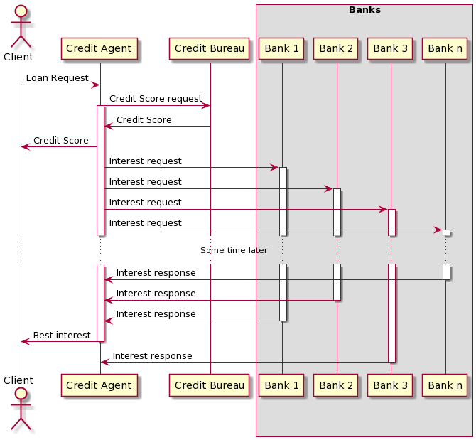
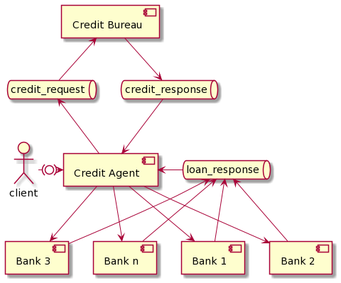

# Bank

## Introduction

Project of a credit agency system. Main subsystems:

- Credit agent - gathers client information and send a loan request
- Credit bureau - collects client's credit score required by the bank to return a loan interest
- Bank - based on client request and their score returns loan interest

When a client wants to get a loan from a bank, he or she has to contact multiple banks, answer some basic questions (loan amount, credit score, credit history) and wait for the response containing loan interest. To make this process more efficient, a creadit agent comes into play. It collects all required data from a client and contacts multiple banks simultaneously. After the broker receives responses, he picks up the best offer and presents it to the client.

Sample laon request sequence represents the diagram below:


## Integration patterns

- Content enricher
- Aggregator
- Request-Replay
- Publish-Subscribe
- Process manager

## Integration patterns that could be used

- Message wrapper
- Message translator
- Outbox pattern
- Invalid message queue
- Dead letter queue
- Circuit breaker

## Architecture overview



## Run solution on the local machine

To run the whole solution on your local machine, `Docker` and `Docker compose` is required. 

In the Hospital directory, type:

```
docker-compose up
```

## Technologies

- dotnet core 5.0
- Blazor
- RabbitMQ
- SignalR
- Docker