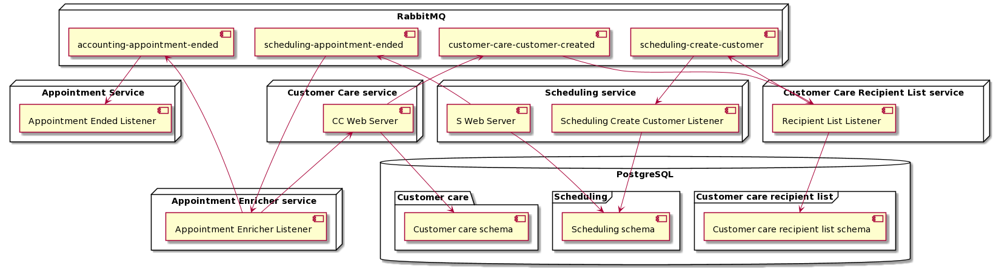

# Hostpital

## Introduction

This project illustrates a Hospital system. The main subsystems are:

- Customer care - handles customers (ex. registration)
- Scheduling - registers patient's visits 
- Accounting - takes care of customer invoicing

The idea is to present that listed components could work independently. A downtime of one of the components doesn't affect others. The basic flow of is:

1. Customer registeres in the `Customer Care`
2. The message with basic customer information is sent to interested in it components via `Customer Care Recipient List`.
3. `Scheduling` register new customers as potential patient.
4. Doctor introduces an ended appointment to the system.
5. Appointment ended message is send to the channel
6. Appointment ended message is enriched with customer address and passed to the `Accounting`. The address is required to send a bill.

## Integration patterns applied

- Recipient List
- Content Enricher
- Point-to-Point communication
- Message wrapper

## Integration patterns that could be added

- Outbox pattern - problems with service bus availability
- Invalid message channel - store invalid messages
- Circuit breaker - problems with temporary coupled components availability

## Architecture overview

## Technologies

- dotnet core 5.0
- Blazor
- RabbitMQ
- PostgreSQL
- Docker